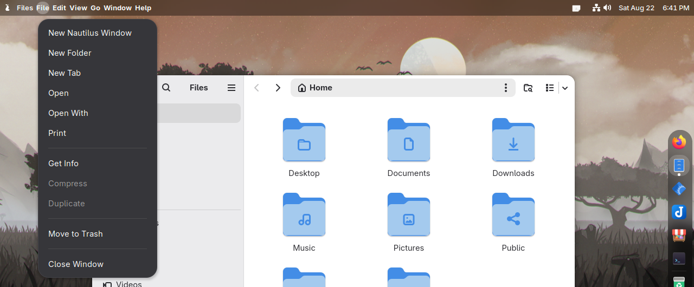
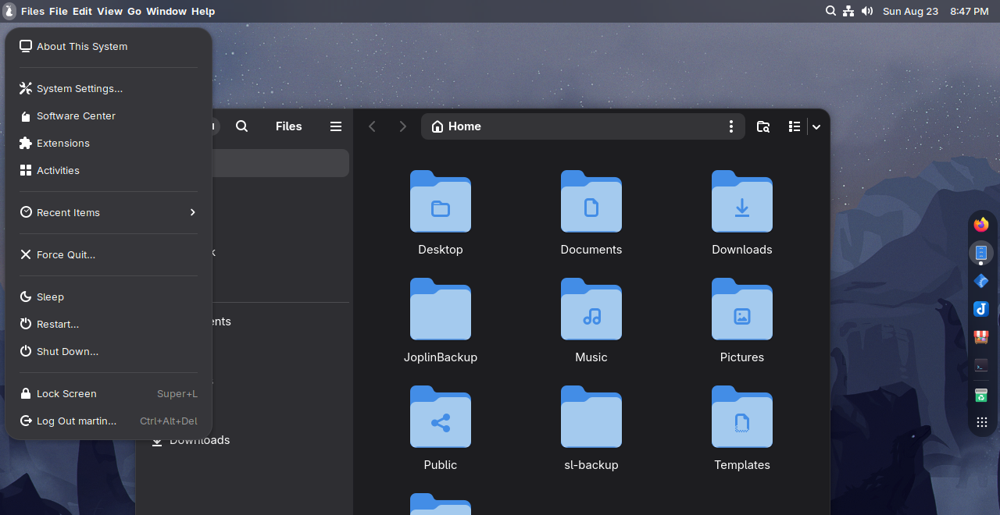
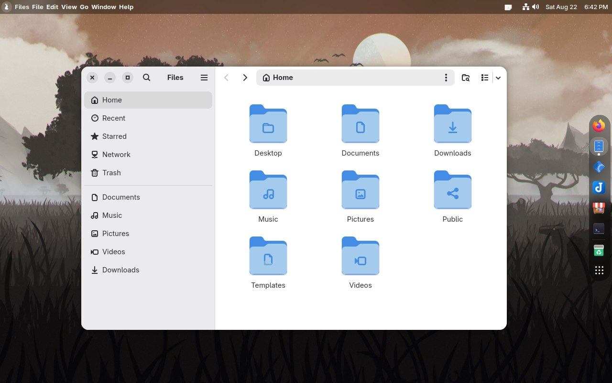
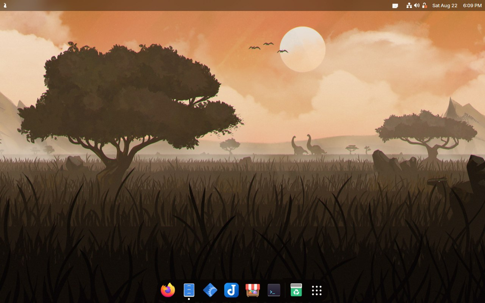
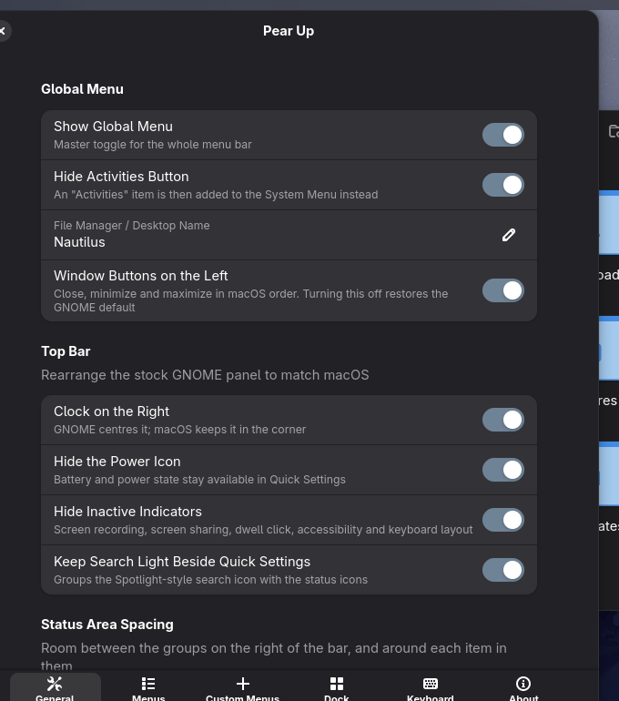
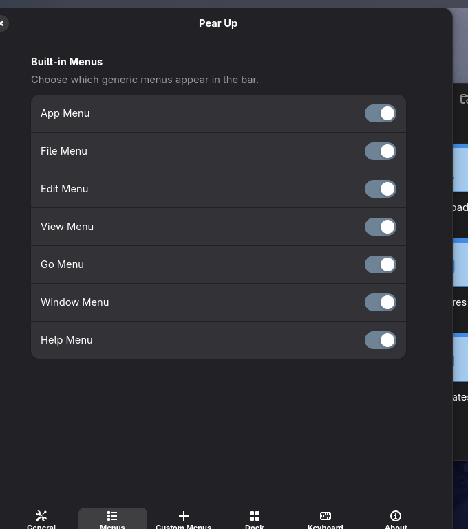
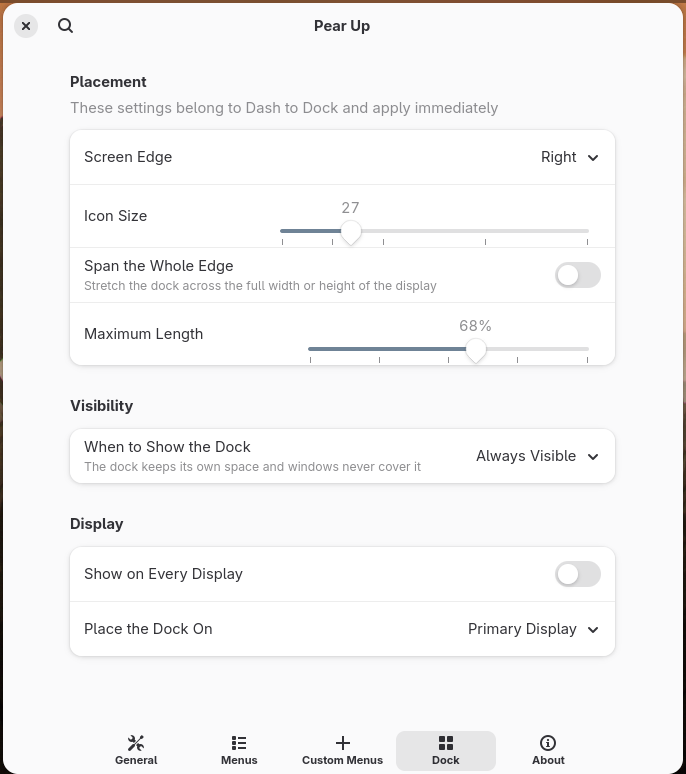
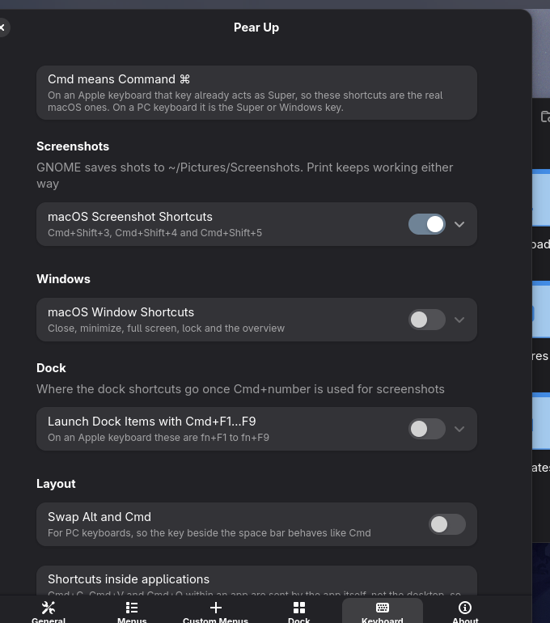

# Pear Up

**Pear up your GNOME.** A macOS-like desktop in a single GNOME Shell extension: a global menu bar for
the focused app, a system menu behind a bitten pear, the clock in the corner, window buttons on the
left, and one settings window that also drives your dock.

> Not affiliated with Apple. The pear is the joke.

The menu engine came from
[global-menu-for-gnome](https://github.com/ShiroOSL/global-menu-for-gnome); see
[Credits](#credits). Not published on extensions.gnome.org, and not supported by its author.



## What it does

**A global menu bar.** The focused application's name and its File, Edit, View, Go, Window and Help
menus live in the top bar instead of inside each window. Every menu can be switched off individually.
When no window is in front, the bar clears itself.

**A system menu.** The bitten pear on the far left opens About This System, System Settings,
Activities, the App Grid, your software centre, system monitor, terminal and extensions manager,
Force Quit, and the power actions — each one optional. The icon can be any bundled distro logo, an
Apple-style glyph, or your own image.



**A macOS-shaped top bar.** The clock moves to the far right with the status icons to its left, the
power glyph is hidden, GNOME's usually-inactive indicators stop reserving space, and a
[Search Light](https://extensions.gnome.org/extension/5489/search-light/) icon can be grouped with
Quick Settings as a Spotlight stand-in. The gaps between the search icon, the control centre icons
and the clock are adjustable, as is the padding each item reserves around itself — the first spreads
the groups out, the second packs them closer than GNOME's own spacing allows.

**A search icon of its own.** Optional, and it sits where macOS keeps Spotlight. What it opens is a
setting: GNOME's own search, which needs nothing installed;
[Search Light](https://extensions.gnome.org/extension/5489/search-light/), if you have it; or any
launcher you name, such as `ulauncher` or `rofi`. Whatever the choice, it falls back to GNOME's
search when that thing is unavailable, so the button is never a dead end.

**Window buttons on the left.** Close, minimize and maximize in macOS order.

**Dock control.** [Dash to Dock](https://extensions.gnome.org/extension/307/dash-to-dock/) is
configured from the same window: which screen edge it sits on, icon size, how much of the edge it may
use, whether it is always visible, hides when a window is in the way, or only appears when you point
at the edge — and which display it belongs to.

| Right edge, always visible | Bottom edge, larger icons |
| --- | --- |
|  |  |

**macOS keyboard shortcuts.** Optional sets you can switch on or off. On an Apple keyboard Command
already acts as Super, so these are the real chords rather than an approximation; on a PC keyboard
read Cmd as the Super or Windows key.

| Shortcut | Does |
| --- | --- |
| `Cmd+Shift+3` | Whole screen straight to a file |
| `Cmd+Shift+4` | Pick a region, window or screen |
| `Cmd+Shift+5` | Screen recording |
| `Cmd+Q` / `Cmd+W` | Close the window |
| `Cmd+M` | Minimize |
| `Ctrl+Cmd+F` | Full screen |
| `Ctrl+Cmd+Q` | Lock the screen |
| `Ctrl+↑` | Overview, like Mission Control |

Screenshots land in `~/Pictures/Screenshots`, and `Print` keeps working alongside. Each accelerator is
added next to GNOME's own rather than replacing it, so switching a set off leaves your own bindings
untouched. Where Dash to Dock already grabs a chord — it takes `Cmd+number` and `Cmd+Q` — the switch
stands that down and offers to move the dock shortcuts to `Cmd+F1…F9` instead.

Shortcuts *inside* an application, like `Cmd+C`, are sent by the app rather than the desktop and
cannot be rebound from here; matching those needs a key remapper such as `keyd`.

**Your own menus.** Add any number of extra top-level menus whose items run shell commands or send
keyboard shortcuts.

## Settings

Everything lives in one window — the panel layout, which menus appear, the dock, and your custom
menus. Open it by pressing <kbd>Super</kbd> and typing "pear", from the app grid, or through the
Extensions app.

These settings cannot appear in GNOME Settings beside Appearance, which is where they arguably
belong: `gnome-control-center` compiles every panel into its binary and has no plugin interface, so
no extension can add one. Installing puts a **Pear Up Settings** application entry in its place.

| General | Menus |
| --- | --- |
|  |  |

| Dock | Keyboard |
| --- | --- |
|  |  |

## Requirements

- GNOME Shell 45 – 50, under Wayland. Every release in that range is checked by the
  [test suite](#testing) rather than assumed; 50 is also what it is used on daily.
- Optional: [Dash to Dock](https://extensions.gnome.org/extension/307/dash-to-dock/) for the Dock page
- Optional: [Search Light](https://extensions.gnome.org/extension/5489/search-light/) for Spotlight-style search

Applications are opened through their desktop files where possible, with fallbacks, so the menu
entries work across distributions rather than assuming GNOME's defaults.

## Install

```bash
git clone https://github.com/maddinek/pear-up.git
cd pear-up
bash install.sh
```

Then log out and back in — GNOME does not load new extension code into a running Wayland session —
and enable **Pear Up** in the Extensions app or Extension Manager.

To remove it:

```bash
bash uninstall.sh
```

## Testing

Both suites run in containers, so no other system has to be installed and nothing touches the
desktop you are using.

**Does it still behave?** Boots a real GNOME Shell headless against a virtual monitor, loads the
extension the way a login would, and checks what it actually did to the panel: the clock moved, the
System Menu appeared with its entries, the power icon is hidden, the bar stays bare while nothing is
in front, the File, Edit, View, Go, Window and Help menus appear once a window is focused and hold
the items they should — and disabling it leaves nothing behind.

The menus are asserted rather than clicked. Activating them through the structure runs the same code
a click would, without depending on pixel coordinates or animation timing, which is where interface
tests usually become unreliable.

```bash
tests/integration/run.sh        # GNOME 50
tests/integration/run.sh 48     # GNOME 48
```

This is the suite worth trusting, because the interesting failures are about timing rather than
missing functions. The power icon survived two fixes precisely because every API involved existed —
it was being hidden before the thing that draws it had been built.

All six releases pass it, which is why `shell-version` claims them:

| GNOME | 45 | 46 | 47 | 48 | 49 | 50 |
| --- | --- | --- | --- | --- | --- | --- |
| Behaviour | ✅ | ✅ | ✅ | ✅ | ✅ | ✅ |
| Screenshot artifact | — | ✅ | ✅ | ✅ | ✅ | ✅ |

Nothing for tests is shipped in the extension. Inspecting a running shell needs a way in — a headless
session has no Looking Glass, and `Eval` refuses to run without the unsafe mode only Looking Glass
can enable — so that capability lives in a separate extension under `tests/integration/hook-extension`
that exists only inside the container.

The screenshot is a convenience, not evidence: whether a recording can be made depends on the
release and the container's media stack, and 45 manages none. The assertions are what matter.

**Do the APIs still exist?** Resolves every GNOME API the extension touches against a given version:
introspected symbols, and the private shell internals that no typelib describes, which are the ones
that vanish quietly between releases.

```bash
tests/run-api-matrix.sh             # every version in the table
tests/run-api-matrix.sh 48 50       # just these
```

`tests/api-manifest.json` is the list of what is depended upon, kept by hand so each entry is a
deliberate statement rather than a grep result.

**Do the preferences still open?** Preferences run in their own process, so nothing above touches
them: a property libadwaita dropped, or a method that never existed, shows up only when the window is
opened — as an empty window and a stack trace in the journal. This builds every page headlessly and
fails on the first throw.

```bash
tests/run-prefs-smoke.sh            # every version in the table
tests/run-prefs-smoke.sh 49 50      # just these
```

**Clicking things in a VM.** GNOME 50 drives its panel buttons with
`Clutter.ClickGesture`, which ignores the synthetic pointer a hypervisor injects — the pointer moves
and hovers, but no button ever activates, and the shell's own clock is just as unresponsive. Mutter's
RemoteDesktop interface goes through the compositor's input path instead, which Clutter cannot tell
from hardware:

```bash
tests/vm/rd-click.py 1038 13        # click, in screen coordinates
tests/vm/rd-click.py 640 400 --move-only
```

Run it inside the session under test. This is what verified the search button's three backends, and
that clicking Search Light no longer ends the session.

**Does it lint?** `eslint.config.mjs` carries the recommended rules and GJS's globals — deliberately
nothing stylistic, so the signal stays the class of mistake that reads fine and breaks at runtime.

```bash
npm ci && npx eslint .
```

Everything except the integration suite also runs in [CI](.github/workflows/ci.yml) on every push.
The checks themselves live in `tests/lib/check-*-here.sh` and run against whatever GNOME is on the
machine that invokes them — locally that machine is a container started by the scripts above, in CI it
is the job container. One implementation either way, so a check cannot pass in CI and fail on a
desktop.

The integration suite stays local: it boots systemd in a privileged container to get logind, and a
runner is the wrong place to find out that has broken.

The workflow itself is verifiable without pushing, which is worth doing before trusting a green tick:

```bash
act --list                      # does it parse, and what would run
act -j api --matrix gnome:50    # run one job here
```

Neither suite replaces reading GNOME's porting notes when a new release lands, and a passing API
matrix is not grounds on its own for widening `shell-version` — behaviour has to be checked too.

## Releases

Build the distributable zip with:

```bash
scripts/pack.sh          # dist/pear-up@maddinek.github.io.shell-extension.zip
```

`gnome-extensions pack` ships only `extension.js`, `prefs.js`, `metadata.json`,
`stylesheet.css` and the schemas, so every other runtime file has to be named — the script holds
that list, because getting it wrong produces a zip that installs and then fails on a machine that
is not this one. Tests, screenshots, the contrib patch and the lint tooling are all deliberately
left out.

[The changelog](CHANGELOG.md) records what each version contains. Two version fields, because they
answer different questions:

| Field | | |
| --- | --- | --- |
| `version` | integer, +1 every published build | what GNOME compares |
| `version-name` | `major.minor.patch` | what a human reads |

Bump both in the commit that ships, and only once the API matrix, the preferences smoke test and the
integration suite have passed on every release in `shell-version`.

## Credits

Pear Up took the menu work over from
[global-menu-for-gnome](https://github.com/ShiroOSL/global-menu-for-gnome) by
[ShiroOSL](https://github.com/ShiroOSL), published on
[extensions.gnome.org](https://extensions.gnome.org/extension/10288/global-menu-for-gnome/). It is a
separate project, not a continuation of that one.

**The global menu itself is their work.** Specifically, still largely as they wrote it:

- **`menuManager.js`** — building the menus, and the handlers behind every entry in them
- **`systemMenu.js`** — the System Menu behind the logo, and what it launches
- **`prefs.js`** and the settings schema — roughly half the preferences, and most of the keys

The rest of the project is not theirs and should not be read as such:

- **`extension.js`** — panel arrangement, the clock, indicator handling, lifecycle
- **`stylesheet.css`** — all of the macOS styling
- The Dock, Keyboard and window-button integration, which drive settings outside this extension
- `tests/` — the container test suites
- `scripts/` — deployment and configuration

Report anything broken on this repository's tracker, the menu included: that code has been changed
enough here that a problem may well be this project's doing rather than theirs. Use
global-menu-for-gnome if you want the published, supported extension instead.

Bundled distro logos are trademarks of their respective owners, included only so each distribution
can be represented in the icon picker.

## License

GPL-3.0, as the code it took over requires.
